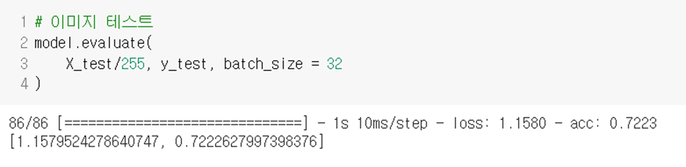

# UFC101 영상 분류

> 프로젝트 설명
> 
- UFC101 dataset (사람들의 101가지 동작을 녹화한 비디오 데이터셋)
- 위 데이터셋 중 3가지 동작을 딥러닝 모델을 활용해 분류하는 프로젝트

---

# 1. 사용 모델

## 1.1 LeNet

---

---

## 1.2. VGG

---

## 1.3. ResNet

---

---

## 1.4. NasNetLarge

## 1.5. ResNext

## 1.6. VGG16 + GRU

---

## 1.7. VGG19 + LSTM

# 2. 정확도 낮은 모델 분석

### 2.1 이미지내 사람 골격 좌표를 이용해 행동을 분석

- 사용 모델 : OpenPose

---

## 2.2 이미지 내 사람부분만 잘라서 학습시키면 더 정확한가?

- OpenCV를 사용해 'person' 기준 프레임 자르기

## 2.3 결과

- 저조한 정확도를 보임. 예측에  단순 사람의 행동 이미지, 골격 좌표 또한 중요하지만 주위 환경, 조도, 사물 등 또한 예측에 많은 영향을 미침